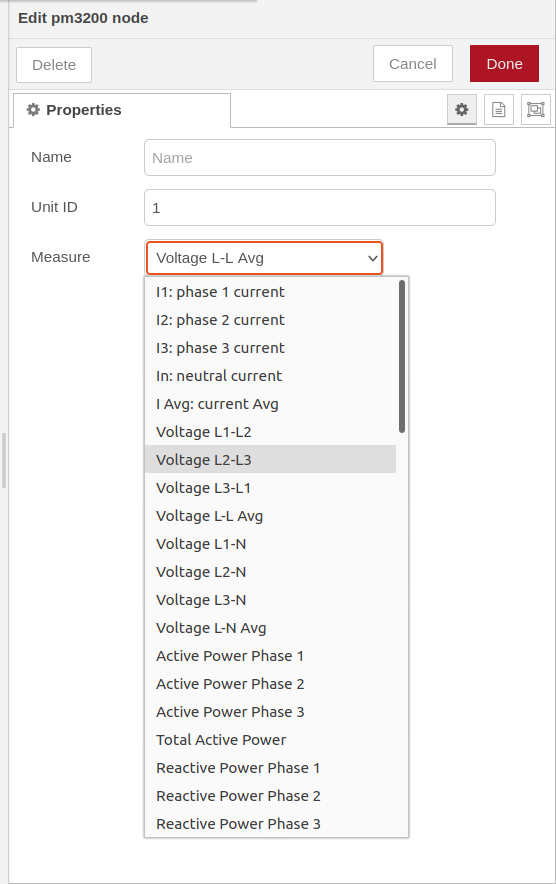
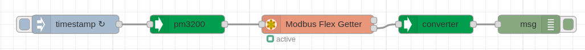

# node-red-contrib-schneider-metsepm3200
A Node-RED node to read Schneider PM3200 series over Modbus TCP/IP
## Node-RED configurator to read Schneider PM3200 over Modbus TCP/IP through Ethernet gateway.

## Install
You can install this node directly from the "Manage Palette" menu in the Node-RED interface.

Alternatively, run the following command in your Node-RED user directory - typically `~/.node-red` on Linux or `%HOMEPATH%\.nodered` on Windows

        npm install node-red-contrib-schneider-metsepm3200 

## How to use

### pm3200 node
Use the `pm3200` node to configure which information you want to request from the gateway.

Wire the output of the `pm3200` to the input of the `Modbus Flex Getter`.

Enable check box `Keep Msg Properties` in the `Modbus Flex Getter` properties.

### converter node
Use the `converter` node to convert the values from the modbus response into human readable numbers.

Wire the second output of the `Modbus Flex Getter` to the input of the `converter`.

## Usage
List of meter data:

| Measure                       | Units                 | Type          | 
| ----------------------------- | --------------------- | ------------- | 
|  I1: phase 1 current          | A                     | Float32       | 
|  I2: phase 2 current          | A                     | Float32       |
|  I3: phase 3 current          | A                     | Float32       |
|  Current Avg                  | A                     | Float32       |

### Meter data 

### Sample flow

## Equipment Compatibility

This module has been developed and tested on:
+ PowerLogic PM3250
+ Ethernet Gateway Link150

